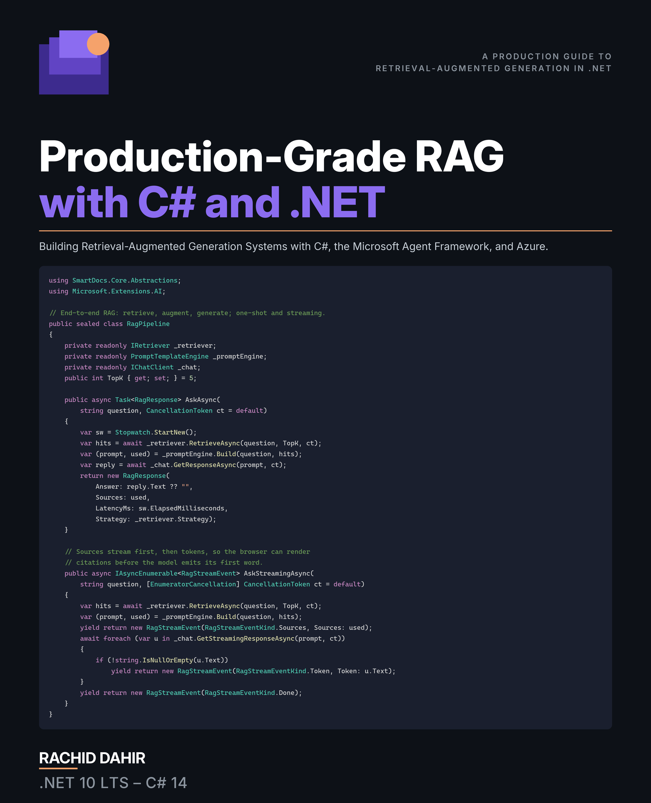

# Production-Grade RAG with C# and .NET

<p align="center">
  
</p>

<p align="center"><strong>Building Retrieval-Augmented Generation Systems with C#, the Microsoft Agent Framework, and Azure</strong></p>

<p align="center"><em>From a Hello-World retriever in ten minutes to an evaluated, secured, compliant RAG system running on Azure — in C# 14 and .NET 10.</em></p>

<p align="center"><strong>📖 <a href="https://leanpub.com/production-graderagwithcsandnet">Read it on Leanpub</a> — pay what you want.</strong></p>

<p align="center"><sub>The book itself ships through Leanpub. This repository hosts the companion code, errata, and reader feedback.</sub></p>

---

## What's in this book

**Retrieval-Augmented Generation** is how you make a language model answer from *your* documents instead of improvising from its training data. This book builds one production system — **Contoso SmartDocs** — across twenty-five chapters, entirely in **C# 14 / .NET 10**, on the **Microsoft Agent Framework 1.20.0** and **Microsoft.Extensions.AI**.

Across seven parts you go from a ten-minute Hello-World RAG through the whole pipeline — embeddings, chunking with Anthropic's Contextual Retrieval, multimodal content, vector databases, indexing, retrieval, reranking, and first-class SSE streaming — into query intelligence, graph and hybrid storage, and the modern design patterns: HyDE, RAPTOR, RAG-Fusion, Self-RAG, CRAG, Vectorless, GraphRAG, LazyGraphRAG, MCP-served retrieval, and multi-agent orchestration. The last third is the part most RAG books skip: evaluation, latency and cost, freshness and drift, security, trust and compliance, and a capstone that ships to Azure with Bicep, runbooks, and an eval gate in CI.

Every code listing is anchored in a runnable project in this repository, every package is pinned centrally, and the whole solution builds warnings-as-errors with **458 passing tests**.

## Table of Contents

| # | Chapter | Part |
|---|---------|------|
| 1 | The AI Landscape | **I — Foundations** |
| 2 | The .NET Toolkit for RAG Development | I |
| 3 | Embeddings: Turning Text into Vectors | **II — The RAG Pipeline** |
| 4 | Chunking and Contextual Retrieval | II |
| 5 | Multimodal RAG | II |
| 6 | Vector Databases | II |
| 7 | Indexing Strategies | II |
| 8 | The Retriever | II |
| 9 | Reranking | II |
| 10 | The Complete RAG Pipeline | II |
| 11 | Metadata Filtering and Query Construction | **III — Query Intelligence** |
| 12 | Query Routing and Conversational Queries | III |
| 13 | Graph Databases for RAG | **IV — Graph and Hybrid Storage** |
| 14 | Hybrid Databases | IV |
| 15 | Classic RAG Enhancements | **V — RAG Design Patterns** |
| 16 | Vectorless RAG | V |
| 17 | GraphRAG and LazyGraphRAG | V |
| 18 | Model Context Protocol | V |
| 19 | Agentic, Multi-Agent, and Memory | V |
| 20 | Evaluation and Metrics | **VI — Production Concerns** |
| 21 | Latency, Cost, and Performance | VI |
| 22 | Freshness, Drift, and Migration | VI |
| 23 | Security | VI |
| 24 | Trust by Design | VI |
| 25 | Production Capstone | **VII — Capstone Project** |

Nine appendices follow: worked exercise solutions, a design-pattern quick reference, a vector-database comparison, an embedding benchmark, a Python-to-.NET Rosetta stone, this repository's tour, a production debugging checklist, prompt-engineering patterns, and the math behind RAG.

---

## Companion code

### Target stack

- **.NET 10** (LTS) / **C# 14**
- **Microsoft Agent Framework 1.20.0**
- **Microsoft.Extensions.AI 10.9.0**
- Visual Studio 2026, or VS Code with the C# Dev Kit

Every package version is pinned centrally in `Directory.Packages.props` (Central Package Management); individual `.csproj` files reference packages without version numbers.

> The solution, projects, and namespaces sit under the `RAG-in-DotNet` / `SmartDocs` identifiers — that is the code path; the title above is the reader-facing brand.

### Prerequisites

- [.NET 10 SDK](https://dotnet.microsoft.com/download/dotnet/10.0)
- **[Ollama](https://ollama.com)** — the default provider, so the samples cost nothing and need no API key. The samples also support Azure OpenAI; Chapter 2 covers the switch.

Everything installs **natively — there is no Docker**. The API and the whole test suite run against an in-memory vector store and cache, so Ollama is the only service you actually need:

```bash
ollama pull nomic-embed-text
ollama pull llama3.2
```

Persistent stores — PostgreSQL + pgvector, Qdrant, Neo4j, Redis — are **optional**, installed only for the chapters that use them. Per-service steps, ports, and the `RUN_*_INTEGRATION` test gates are in [`docs/local-setup.md`](docs/local-setup.md).

### Clone & build

```bash
git clone https://github.com/RachidD68/production-grade-rag-with-csharp-and-dotnet.git
cd production-grade-rag-with-csharp-and-dotnet
dotnet build RAG-in-DotNet.slnx
dotnet test
```

Open `RAG-in-DotNet.slnx` once and every project loads together. `dotnet test` should report **458 passing tests** on a clean clone.

### Run a sample

```bash
# Chapter 1: the 10-minute Hello-World RAG
dotnet run --project samples/Ch01_HelloWorldRag

# The Minimal API — /health shows the active provider and models
dotnet run --project src/SmartDocs.Api
```

First generate the synthetic Contoso corpus (six document silos) if a sample needs it:

```bash
dotnet run --project tools/generate-dataset -- --small --output data
```

### Configuration

Provider settings live in `appsettings.json`; secrets belong in a gitignored `appsettings.local.json` or in [.NET User Secrets](https://learn.microsoft.com/aspnet/core/security/app-secrets) — never in source control. The default is Ollama on `http://localhost:11434`. To switch to Azure OpenAI:

```bash
dotnet user-secrets set "SmartDocs:Llm:Provider" "AzureOpenAI"
dotnet user-secrets set "SmartDocs:Llm:Endpoint" "https://YOUR-RESOURCE.openai.azure.com/"
dotnet user-secrets set "SmartDocs:Llm:ApiKey" "YOUR-KEY"
```

Embedding dimensions differ between providers (`nomic-embed-text` is 768, `text-embedding-3-small` is 1536), and vector collections are dimension-bound — switching providers means re-embedding the corpus. Chapter 22 makes that an explicit lesson rather than an accident.

### Repository layout

| Folder | Chapter | Topic |
|--------|---------|-------|
| `src/SmartDocs.Core/` | 1–2, 11 | Domain models, the `IVectorStore` / `IRetriever` ports, DI, metadata filters |
| `src/SmartDocs.Ingestion/` | 3–5, 7 | Parsing, chunking, Contextual Retrieval, embeddings, indexing |
| `src/SmartDocs.Retrieval/` | 6, 8, 13–17 | Dense, sparse, hybrid, graph, and vectorless retrievers; vector stores |
| `src/SmartDocs.Retrieval.{Qdrant,Postgres,AzureSearch}/` | 14 | Backend leaf packages over the hybrid retrievers |
| `src/SmartDocs.Reranking/` (+ `.Cohere`, `.Onnx`) | 9 | Cohere, ONNX cross-encoder, and LLM rerankers |
| `src/SmartDocs.Routing/` | 11–12 | Query construction, self-query, routing, conversational rewriting |
| `src/SmartDocs.Generation/` | 10 | Prompt templates, context assembly, citation tracking |
| `src/SmartDocs.Agents/` | 19 | `ChatClientAgent`, tools, the Workflow graph, agentic memory |
| `src/SmartDocs.Mcp/` | 18 | MCP server tools and resources |
| `src/SmartDocs.Security/` | 23 | Sanitization, injection detection, redaction, hash-chained audit |
| `src/SmartDocs.Evaluation/` | 20 | Retrieval / generation metrics, statistical significance |
| `src/SmartDocs.Operations/` | 22, 24 | Freshness, drift adapter, GDPR erasure, compliance |
| `src/SmartDocs.Performance/` | 21 | Caching, SIMD cosine, Polly, OpenTelemetry, cost metering |
| `src/SmartDocs.Api/` | 10, 25 | ASP.NET Core Minimal API with first-class SSE streaming |
| `src/SmartDocs.Dashboard/` | 20 | Blazor evaluation dashboard |
| `samples/` | 1–22 | One runnable micro-project per chapter that has one |
| `tests/` | — | 458 xUnit tests: unit, security (25-case red team), integration, eval |
| `tools/` | 20, 22, 25 | Dataset generator, eval-runner (`--gate`), smoke/load test, reindex |
| `deploy/` | 25 | Bicep templates, prod deployment and NuGet publish workflows |
| `docs/` | — | Local setup, architecture, ADRs, runbooks, preflight checklist |

## A note on the workflow badges

`ci` — build, test and format across Ubuntu and Windows — is the workflow that gates this
repository, and it is green.

**`deploy-prod` fails here, on purpose-ish.** It is the reference deployment pipeline from
Chapter 25, published so you can read it. It is not connected to a live Azure subscription:
this repository holds no Azure credentials, so `azure/login` has nothing to authenticate with
and the deploy jobs fail on every push to `main`. That is a configuration gap, not a broken
pipeline — the workflow is exactly what the chapter describes. Point it at your own
subscription (a federated OIDC credential plus `prod`/`staging` GitHub Environments) and it
runs as written.

`publish-nuget` only fires when a GitHub Release is published, which is the deliberate,
human-gated step that ships the packages.

## Errata & feedback

Spotted a typo, a code sample that won't compile, or an outdated API? Please open an [**errata report**](../../issues/new?template=errata.yml). Reader corrections are how the book gets better.

## License

Companion code released under the [MIT License](LICENSE). The book text is © 2026 Rachid Dahir and distributed via [Leanpub](https://leanpub.com/production-graderagwithcsandnet).
