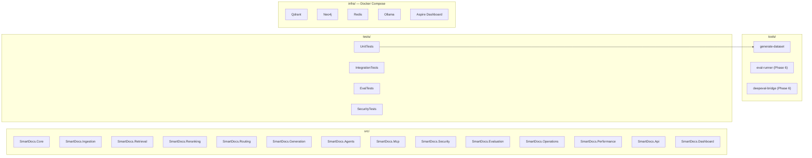
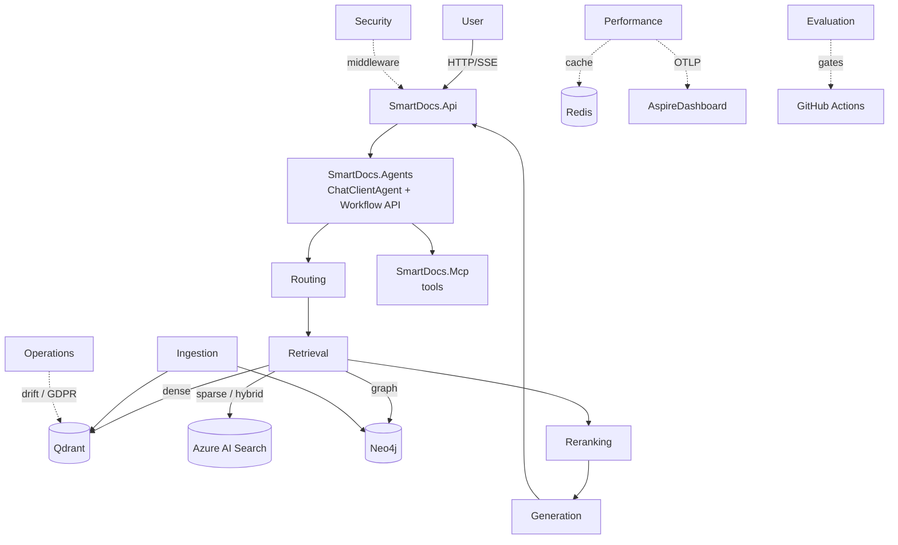

# Architecture

> Updated at the end of every phase. **Last updated: end of Phase 0.**

This document is the canonical view of the SmartDocs architecture as it stands *today*. As chapters add capabilities, the diagrams below grow.

## Phase 0 — Project Skeleton

At the end of Phase 0 the solution compiles but no real RAG code is written yet. Each box below is an empty C# project containing only a `Placeholder.cs` file naming the chapter that will populate it.

Project references in Phase 0 are minimal — only the `SmartDocs.UnitTests → tools/generate-dataset` reference exists. Real dependencies between `src/` projects are added as code lands in Phases 1–7.

## Target Architecture (Phase 7 endpoint — informational)

The full Contoso SmartDocs runtime is a layered RAG pipeline driven by a Microsoft Agent Framework agent. This diagram is **forward-looking** — none of the boxes besides `SmartDocs.Api` and `Dashboard` produce running code yet.

Update history:

- **2026-05-02 (end of Phase 0)** — first cut. Projects exist but contain only placeholders.
